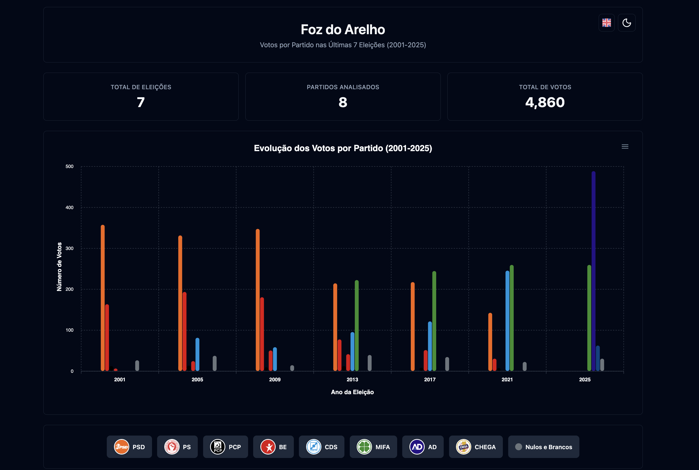

# 🗳️ Análise Eleitoral Foz do Arelho (2001-2025)

[](https://fozvotos.website/)
[](LICENSE)
[](https://developer.mozilla.org/en-US/docs/Web/HTML)
[](https://developer.mozilla.org/en-US/docs/Web/JavaScript)
[](https://apexcharts.com/)

Uma aplicação web interativa para análise dos resultados eleitorais da **Foz do Arelho** cobrindo 7 eleições municipais de 2001 a 2025. Oferece visualizações detalhadas, estatísticas e dados históricos dos partidos políticos locais.



## ✨ Características

### 📊 **Visualização de Dados**
- **Gráficos interativos** com ApexCharts
- **Tabelas detalhadas** com dados por eleição
- **Estatísticas em tempo real** (total de eleições, partidos, votos)
- **Cores personalizadas** para cada partido político

### 🚀 **Otimizações SEO & AI**
- **Dados estruturados** Schema.org completos
- **Meta tags avançadas** para AI e motores de busca
- **Sitemap XML** otimizado com imagens
- **Progressive Web App** (PWA) support
- **Compressão GZIP** e cache headers
- **Acessibilidade WCAG** compliant

### 🌍 **Multi-idioma**
- **Português** (padrão)
- **Inglês**
- Alternância dinâmica de idioma

### 🎨 **Interface Moderna**
- **Dark/Light Mode** com alternância suave
- **Design responsivo** para todos os dispositivos
- **Ícones Lucide** para melhor UX
- **Animações CSS** suaves

### 📈 **Dados Cobertos**
- **7 Eleições:** 2001, 2005, 2009, 2013, 2017, 2021, 2025
- **8 Partidos:** PS, PSD, MIFA, CDS, BE, PCP, AD, CHEGA
- **Métricas:** Votos totais, percentagens, participação eleitoral

## 🚀 Demonstração

### Funcionalidades Principais:
- 📊 Gráfico de barras interativo
- 📋 Tabela com dados históricos
- 🔄 Alternância de tema (claro/escuro)
- 🌐 Suporte multi-idioma
- 📱 Interface responsiva

## 🛠️ Tecnologias Utilizadas

| Tecnologia | Versão | Uso |
|------------|--------|-----|
| **HTML5** | Latest | Estrutura e semântica |
| **CSS3** | Latest | Estilização e responsividade |
| **JavaScript** | ES6+ | Lógica e interatividade |
| **ApexCharts** | Latest | Gráficos interativos |
| **Lucide Icons** | Latest | Iconografia |
| **Schema.org** | - | SEO e dados estruturados |

## 📦 Instalação

### Pré-requisitos
- Navegador web moderno
- Servidor web local (opcional)

### Instalação Local
```bash
# Clone o repositório
git clone https://github.com/nunosantoswebdesigner/contador-de-votos

# Entre no diretório
cd contador-de-votos

# Abra o arquivo index.html no navegador
# OU inicie um servidor local:

# Python 3
python -m http.server 8000

# Python 2
python -SimpleHTTPServer 8000

# Node.js (com http-server)
npx http-server

# Acesse: http://localhost:8000
```

## 🔧 Configuração

### 1. **Configuração de Domínio**
Para compartilhamento social correto, substitua `SEU_DOMINIO.com` no `index.html`:

```html
<meta property="og:url" content="https://fozvotos.website/">
<meta property="og:image" content="https://fozvotos.website/imagens/logo.png">
```

### 2. **Personalização de Dados**
Os dados estão no objeto `dadosEleicoes` no arquivo `index.html`:

```javascript
const dadosEleicoes = {
    anos: ['2001', '2005', '2009', '2013', '2017', '2021', '2025'],
    partidos: {
        'PSD': { votos: [358, 332, 348, 215, 218, 143, 0], cor: '#F4660C' },
        // Adicione ou modifique partidos aqui
    }
};
```

## 📁 Estrutura do Projeto

```
contador-de-votos/
├── 📄 index.html              # Página principal
├── 📁 imagens/                # Assets visuais
│   ├── 🖼️ logo.png           # Logo principal
│   ├── 🇵🇹 pt.svg            # Bandeira Portugal
│   ├── 🇬🇧 en.svg            # Bandeira Inglaterra
│   └── 🎨 *.png              # Logos dos partidos
├── 📋 README.md               # Este arquivo
├── ⚙️ CONFIGURACAO_SHARING.md # Guia de configuração
└── 📜 LICENSE                 # Licença do projeto
```

## 📊 Dados das Eleições

### Partidos Incluídos:
- **PS** - Partido Socialista
- **PSD** - Partido Social Democrata  
- **MIFA** - Movimento Independente Foz do Arelho
- **CDS** - Centro Democrático Social
- **BE** - Bloco de Esquerda
- **PCP** - Partido Comunista Português
- **AD** - Aliança Democrática
- **CHEGA** - Chega

### Período Analisado:
**2001 - 2025** (7 eleições municipais)

## 🔍 SEO e Acessibilidade

### ✅ Implementado:
- **Schema.org** para dados estruturados
- **Open Graph** para redes sociais
- **Twitter Cards** para melhor compartilhamento
- **Meta tags** otimizadas para SEO
- **Alt text** em todas as imagens
- **Semântica HTML5** apropriada

## 🌐 Compatibilidade

### Navegadores Suportados:
- ✅ Chrome 80+
- ✅ Firefox 75+
- ✅ Safari 13+
- ✅ Edge 80+

### Dispositivos:
- 📱 Mobile (iOS/Android)
- 💻 Desktop
- 📟 Tablet

## 🤝 Contribuição

Contribuições são bem-vindas! Para contribuir:

1. **Fork** o projeto
2. Crie uma **branch** para sua feature (`git checkout -b feature/AmazingFeature`)
3. **Commit** suas mudanças (`git commit -m 'Add some AmazingFeature'`)
4. **Push** para a branch (`git push origin feature/AmazingFeature`)
5. Abra um **Pull Request**

### 📝 Diretrizes:
- Mantenha o código limpo e documentado
- Teste em múltiplos navegadores
- Siga as convenções de nomenclatura existentes
- Atualize a documentação quando necessário

## 📈 Roadmap

### 🎯 Próximas Features:
- [ ] **Exportação** de dados (CSV, PDF)
- [ ] **Comparação** entre eleições
- [ ] **Filtros avançados** por período
- [ ] **API** para dados externos
- [ ] **Modo offline** com Service Worker
- [ ] **Análise preditiva** com IA

## 📄 Licença

Este projeto está sob a licença **MIT**. Veja o arquivo [LICENSE](LICENSE) para mais detalhes.

```
MIT License - você pode usar, modificar e distribuir livremente.
```

## 👨‍💻 Autor

**Nuno Santos**
- 📷 Instagram: [@nunosantosdev](https://www.instagram.com/nunosantosdev/)
- 💼 LinkedIn: [Nuno Santos](https://linkedin.com/in/nunosantosdev)
- 🐙 GitHub: [@nunosantos](https://github.com/nunosantoswebdesigner)

## 🙏 Agradecimentos

- **Ministério da Administração Interna** - Dados eleitorais oficiais
- **ApexCharts** - Biblioteca de gráficos
- **Lucide** - Ícones modernos
- **Comunidade Foz do Arelho** - Apoio e feedback

---

<div align="center">

**⭐ Se este projeto foi útil, considere dar uma estrela!**

[🌐 Website](https://fozvotos.website/) • [📊 Análise](https://fozvotos.website/) • [📧 Contato](mailto:seu-email@exemplo.com)

---

*Desenvolvido com ❤️ para a comunidade da Foz do Arelho*

</div>